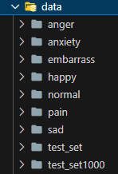

# est_wassup_6

you can modify hyperparameters in modulize/config.py

run ResNet classification with
- python main.py --m ResNet

run Vision transformer classification with
- python main.py --m VitClassification

run ResNet detection with
- python main.py --m ResNetDetection

run Vision transformer classification with
- python main.py --m VitDetection 

run streamlit web with
- streamlit run app.py

the dataset structure should be like this :

